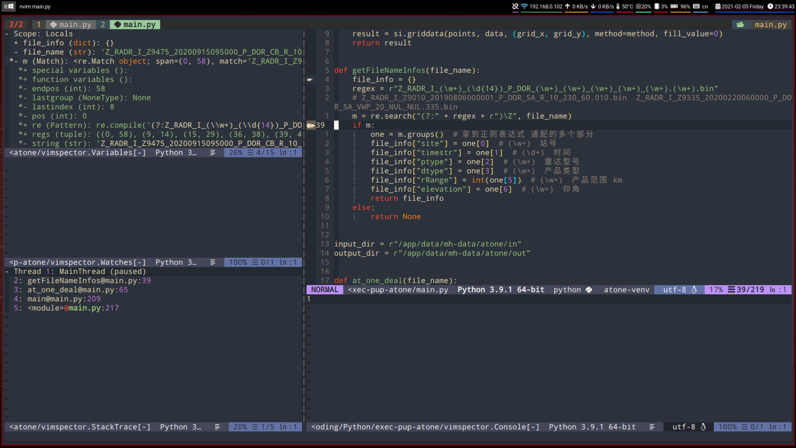

<!-- vim-markdown-toc GFM -->

* [1. neovim config](#1-neovim-config)
    * [1.2 Plug list](#12-plug-list)
* [2. Plug install and config](#2-plug-install-and-config)
    * [2.1 debug plug(vimspector)](#21-debug-plugvimspector)
        * [2.1.1 vimspector install](#211-vimspector-install)
        * [2.1.2 vimspector base config](#212-vimspector-base-config)
        * [2.1.3 language debug config](#213-language-debug-config)
        * [2.1.4 vimspector mappings config](#214-vimspector-mappings-config)
    * [2.2 coc plugins list](#22-coc-plugins-list)

<!-- vim-markdown-toc -->

# 1. neovim config

This is my neovim custom config

## 1.2 Plug list

1. [vimspector](#21-debug-plugvimspector)
2. [coc](#22-coc-plugins-list)


# 2. Plug install and config

## 2.1 debug plug(vimspector)

[https://github.com/puremourning/vimspector](https://github.com/puremourning/vimspector)



### 2.1.1 vimspector install

1. **vim-plug**

```
Plug 'puremourning/vimspector', {'do': './install_gadget.py --enable-python --enable-go'}
```

2. **intsall**

```bash
## Install vimspector plug
:PlugInstall

## Install adapter of python/golang
:VimspectorInstall debugpy
:VimspectorInstall vscode-go
```

3. **dependencies**

- golang: go, delve
- python: python2.7 or python3


**devle install**

[https://github.com/go-delve/delve/blob/master/Documentation/installation/linux/install.md](https://github.com/go-delve/delve/blob/master/Documentation/installation/linux/install.md)

```bash
git clone https://github.com/go-delve/delve.git $GOPATH/src/github.com/go-delve/delve
cd $GOPATH/src/github.com/go-delve/delve
make install
```

### 2.1.2 vimspector base config

```vim
let g:vimspector_enable_mappings = 'HUMAN'
function! s:read_template_into_buffer(template)
    " has to be a function to avoid the extra space fzf#run insers otherwise
    execute '0r ~/.config/nvim/sample_vimspector_json/'.a:template
endfunction
command! -bang -nargs=* LoadVimSpectorJsonTemplate call fzf#run({
            \   'source': 'ls -1 ~/.config/nvim/sample_vimspector_json',
            \   'down': 20,
            \   'sink': function('<sid>read_template_into_buffer')
            \ })
" noremap <leader>vs :tabe .vimspector.json<CR>:LoadVimSpectorJsonTemplate<CR>
sign define vimspectorBP text=☛ texthl=Normal
sign define vimspectorBPDisabled text=☞ texthl=Normal
sign define vimspectorPC text=🔶 texthl=SpellBad
```

### 2.1.3 language debug config

1. **python debug config**

> Create file `.vimspector.json` in project folder, and add contents below.
> If you are using virtualenv to run python code, then you need modify the python param to your venv's python path

```json
{
	"configurations": {
		"Python: Run current script": {
			"adapter": "debugpy",
			"configuration": {
				"request": "launch",
				"program": "${file}",
				"args": ["*${args:--update-gadget-config}"],
				"justMyCode#json": "${justMyCode:true}",
				"python": "$WORKON_HOME/venv/bin/python"
			}
		}
	}
}
```

2. golang debug config

TODO

### 2.1.4 vimspector mappings config

1. keybindings config

```vim
nmap <leader>dd <Plug>VimspectorContinue
nmap <leader>dx <Plug>VimspectorStop
nmap <leader>dr <Plug>VimspectorRestart
nmap <leader>dp <Plug>VimspectorPause
nmap <leader>di <Plug>VimspectorToggleBreakpoint
nmap <leader>da <Plug>VimspectorToggleConditionalBreakpoint
nmap <leader>df <Plug>VimspectorAddFunctionBreakpoint
nmap <leader>dj <Plug>VimspectorStepOver
nmap <leader>dl <Plug>VimspectorStepInto
nmap <leader>dq <Plug>VimspectorStepOut
nmap <leader>dn <Plug>VimspectorRunToCursor
```

2. vim-which-key config

```vim
let g:which_key_map['d'] = {
            \ 'name' : '+Debugger',
            \ 'a' : [ '<Plug>VimspectorToggleConditionalBreakpoint' , '(F9)Toggle conditional line breakpoint on the current line'],
            \ 'd' : [ '<Plug>VimspectorContinue'                    , '(F5)When debugging, continue. Otherwise start debugging'],
            \ 'f' : [ '<Plug>VimspectorAddFunctionBreakpoint'       , '(F8)Add a function breakpoint for the expression under cursor'],
            \ 'i' : [ '<Plug>VimspectorToggleBreakpoint'            , '(<leader>F9)Toggle line breakpoint on the current line'],
            \ 'j' : [ '<Plug>VimspectorStepOver'                    , '(F10)Step Over'],
            \ 'l' : [ '<Plug>VimspectorStepInto'                    , '(F11)Step Into'],
            \ 'n' : [ '<Plug>VimspectorRunToCursor'                 , '(<leader>F8)Run to Cursor'],
            \ 'p' : [ '<Plug>VimspectorPause'                       , '(F6)Pause debugee.'],
            \ 'q' : [ '<Plug>VimspectorStepOut'                     , '(F12)Step out of current function scope'],
            \ 'r' : [ '<Plug>VimspectorRestart'                     , '(F4)Restart debugging with the same configuration'],
            \ 'x' : [ '<Plug>VimspectorStop'                        , '(F3)Stop debugging']
            \}
```

## 2.2 coc plugins list

```bash
coc-actions
## coc-bookmark已被弃用2021-01-20
coc-bookmark
coc-clangd
coc-cmake
coc-css
coc-docker
coc-emmet
coc-eslint
coc-explorer
coc-flutter
coc-git
coc-go
coc-highlight
coc-html
coc-java
coc-jedi
coc-json
coc-markdownlint
coc-pairs
coc-prettier
coc-python
coc-snippets
coc-syntax
coc-todolist
coc-translator
coc-tslint
coc-vimlsp
coc-xml
coc-yaml
coc-sql
```
